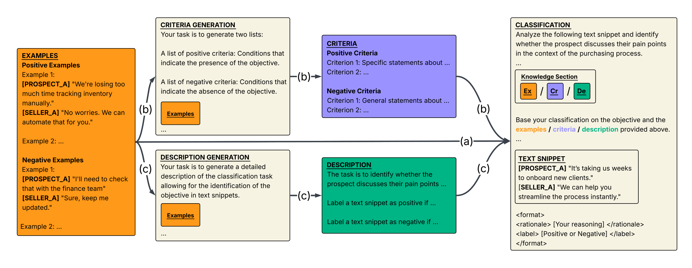

<div align="center">

# Distilling Examples into Task Instructions: Enhanced In-Context Learning for Real-World B2B Conversations

*Replacing few-shot examples with automatically extracted task knowledge for scalable, interpretable B2B conversation classification.*

<br>

[](https://www.gong.io)
[](https://2026.aclweb.org/)
[](https://aclanthology.org/2026.findings-acl.1631.pdf)
[](https://www.python.org/)
[](LICENSE)
[](https://huggingface.co/datasets/gong-io-research/call-playbook)

<br>

</div>

---

## Table of Contents

- [Overview](#overview)
- [Methods at a Glance](#methods-at-a-glance)
- [The Call Playbook Dataset](#the-call-playbook-dataset)
- [Getting Started](#getting-started)
- [Outputs](#outputs)
- [Experiment Tracking](#experiment-tracking)
- [Project Structure](#project-structure)
- [Citation](#citation)

---

## Overview

In B2B sales, automatically classifying conversation segments at scale, across diverse and evolving intents, requires handling scarce labeled data, keeping annotation overhead low, and avoiding per-intent fine-tuning. Few-shot **In-Context Learning (ICL)** is theoretically suited to these constraints, but in practice concatenating multiple long conversation snippets causes severe performance degradation well before hitting context-window limits.

**This work proposes a novel extraction framework** that shifts from example concatenation to a different representational form entirely. A single offline step uses an LLM to transform a small set of labeled examples into natural-language classification criteria or task descriptions. At inference time, those compact artifacts replace the examples, producing transparent, human-editable decision logic with no lossy compression.

### Key Contributions
* **Performance:** Up to **7% improvement in macro-averaged AUC** over direct few-shot ICL.
* **Efficiency:** **99% reduction in token usage**, enabling classification at scale at a fraction of the cost.
* **Interpretability:** Human-readable, editable criteria/descriptions enable human-in-the-loop refinement.
* **Cross-model transfer:** Large models can distill task knowledge for deployment on smaller ones.
* **Dataset:** The **Call Playbook Dataset** — 5 binary classification tasks from real, anonymized enterprise sales conversations.

<br>



<br>

## Methods at a Glance

All methods share the same classifier prompt structure; they differ in what knowledge is passed to it.

**Examples** is the standard few-shot baseline: N sampled training examples are included directly in the classification prompt. Each B2B conversation snippet can be hundreds of words long, so token cost grows quickly with N, and the model must infer classification rules implicitly from the examples.

**Criteria-Ex** replaces the examples with explicit classification criteria extracted from them. Given the sampled examples and the task objective, an LLM generates two lists: positive criteria (patterns indicating the concept is present) and negative criteria (patterns indicating its absence). This reduces token usage substantially, makes the classification logic transparent, and improves generalization by surfacing patterns rather than relying on specific instances.

**Description-Ex** follows the same two-step structure but extracts a free-text task description instead of criteria. The description captures the essence of the classification task and clarifies concept boundaries, providing a cohesive narrative that can better capture complex, context-dependent relationships that rigid criteria may miss.

**Criteria-De** and **Description-Cr** are iterative variants. Criteria-De derives criteria from a Description-Ex output; Description-Cr derives a description from a Criteria-Ex output. These variants explore whether knowledge representations can be progressively refined and are particularly suited to human-in-the-loop workflows, where users can inspect and edit an intermediate artifact before the final classification step.

| Method | Knowledge extraction | Classifies with | Token cost |
|---|---|---|---|
| **Examples** | None | Raw examples | High |
| **Criteria-Ex** | Derives positive/negative criteria from examples | Criteria | Low |
| **Description-Ex** | Derives a free-text task description from examples | Description | Low |
| **Criteria-De** | Description-Ex output → criteria | Criteria | Low |
| **Description-Cr** | Criteria-Ex output → description | Description | Low |

<br>

---

## The Call Playbook Dataset

<div align="center">

### Access the Dataset

**[🤗 gong-io-research/call-playbook on Hugging Face →](https://huggingface.co/datasets/gong-io-research/call-playbook)**

</div>

<br>


<br>

The **Call Playbook Dataset** contains annotated excerpts from real enterprise sales conversations across **5 binary classification tasks**, each capturing a critical signal in the B2B sales process:

| Task | Positive class definition | Example positive |
|---|---|---|
| **Business Goals** | Desired outcomes or strategic objectives articulated by the prospect | *"We need to cut churn by 20% before Q3."* |
| **Decision Criteria** | Specific attributes, features, or evaluation metrics used by the prospect to assess potential solutions | *"Security compliance is non-negotiable for us."* |
| **Decision Makers** | Individuals or roles identified as having authority or influence over the purchasing decision | *"This ultimately goes to our VP of Finance."* |
| **Decision Making Process** | The series of steps or procedures described by the prospect for arriving at a final decision | *"We run a 3-week POC with two vendors in parallel."* |
| **Pain Points** | Inefficiencies, obstacles, or needs expressed by the prospect that they aim to address through a potential solution | *"Our current tool breaks on calls longer than an hour."* |

<br>

### Setup

The dataset is available on Hugging Face. Request access at **[gong-io-research/call-playbook](https://huggingface.co/datasets/gong-io-research/call-playbook)**, then install the `datasets` library and load any task by name:

```python
from datasets import load_dataset

# Load a single task
ds = load_dataset("gong-io-research/call-playbook", "business_goals")

print(ds["train"][0])
# {'id': 0, 'text': '[PROSPECT_A] We need to reduce churn ...', 'label': 1}
```

Available configurations: `business_goals`, `decision_criteria`, `decision_makers`, `decision_making_process`, `pain_points`.

```python
from datasets import load_dataset

tasks = [
    "business_goals",
    "decision_criteria",
    "decision_makers",
    "decision_making_process",
    "pain_points",
]

for task in tasks:
    ds = load_dataset("gong-io-research/call-playbook", task)
    print(task, ds["train"].num_rows, ds["test"].num_rows)
```

To use the dataset with this codebase, save each split as CSV files under `call_playbook_dataset/`:

```python
import os
from datasets import load_dataset

for task in tasks:
    ds = load_dataset("gong-io-research/call-playbook", task)
    os.makedirs(f"call_playbook_dataset/{task}", exist_ok=True)
    ds["train"].to_csv(f"call_playbook_dataset/{task}/train.csv", index=False)
    ds["test"].to_csv(f"call_playbook_dataset/{task}/test.csv", index=False)
```

Pass the task subfolder as `--data_dir` (e.g., `--data_dir ./call_playbook_dataset/business_goals`).

### Format

Each task contains `train.csv` / `test.csv` with the following structure:

```
id,text,label
0,"[PROSPECT_A] We need to reduce churn before Q3. [SELLER_A] Absolutely, let's talk about how.",1
1,"[SELLER_A] Great, I'll send over the proposal tonight. [PROSPECT_A] Sounds good.",0
```

Conversations are represented as **speaker-tagged utterance sequences**, preserving turn structure while enabling flexible windowing.

### Speaker Tags

Speaker roles are annotated inline within each snippet:

| Tag | Role |
|---|---|
| `[PROSPECT_A]`, `[PROSPECT_B]` | Prospect-side speakers |
| `[SELLER_A]`, `[SELLER_B]` | Seller-side speakers |
| `[SPEAKER_A]`, ... | Generic speaker (role unknown) |

### Dataset Statistics

| Task | Train Samples | Train Calls | Test Samples | Test Calls | Avg Words |
|---|---|---|---|---|---|
| **Business Goals** | 200 | 25 | 200 | 25 | ~284 |
| **Decision Criteria** | 200 | 25 | 200 | 25 | ~276 |
| **Decision Makers** | 200 | 25 | 200 | 25 | ~267 |
| **Decision Making Process** | 200 | 20 | 200 | 21 | ~267 |
| **Pain Points** | 200 | 25 | 200 | 25 | ~286 |

<br>

### Privacy & Anonymization

All data has been rigorously anonymized before release. Named entities were identified and systematically replaced with fictional alternatives that preserve conversational realism:

| Entity type | Replacements | Sample substitutions |
|---|---|---|
| Organizations | 120+ | "Quantum Solutions", "Zenith Innovations", "Nebula Technologies" |
| Persons | 130+ | "Alex", "Jordan", "Casey", "Taylor" |
| Products | 80+ | "CodeCraft", "QuantaQuery", "NebulaNet" |
| Locations | 180+ | "Varthevia", "Brindmere", "Corswick" |
| URLs / IDs / Phones / Emails | 20+ | anonymized placeholder formats |

The full replacement table is in [`replacements.json`](replacements.json).

<br>

---

## Getting Started

### Installation

Requires Python >= 3.12.

```bash
git clone https://github.com/gong-io/call-playbook
cd call-playbook
pip install uv
uv venv .venv
source .venv/bin/activate  # Windows: .venv\Scripts\activate
uv pip install -r requirements.txt
```

### Configure credentials

Create a `.env` file in the project root:

```bash
# Azure OpenAI
AZURE_OPENAI_API_KEY=your_key
AZURE_OPENAI_ENDPOINT=https://your-resource.openai.azure.com/
OPENAI_API_VERSION=your_api_version
AZURE_OPENAI_MODEL_VERSION=your_model_version

# AWS Bedrock
AWS_PROFILE=your_profile
AWS_REGION=us-east-1
AWS_BEDROCK_ENDPOINT=https://your-bedrock-endpoint.amazonaws.com
```

### Run an experiment

```bash
python run_classification.py \
  --model_id gpt-4o \
  --model_source azure \
  --objective "the prospect discusses their business goals in the context of the purchasing process." \
  --data_dir ./call_playbook_dataset/business_goals \
  --output_dir ./results/business_goals \
  --num_few_shot_examples 0 10 25 50 75 100 \
  --num_experiments 5 \
  --env_file .env
```

Or pass everything via a config file:

```bash
python run_classification.py --config config.json --env_file .env
```

<details>
<summary>Full config.json reference</summary>

```json
{
    "model_id": "gpt-4o",
    "model_source": "azure",
    "objective": "the prospect discusses their business goals in the context of the purchasing process",
    "data_dir": "./call_playbook_dataset/business_goals",
    "num_few_shot_examples": [0, 10, 25, 50, 75, 100],
    "num_experiments": 5,
    "batch_size": 10,
    "output_dir": "./results/business_goals",
    "use_wandb": false,
    "override": false,
    "mix_examples": false,
    "sampling_method": "label_distribution",
    "label_column": "label",
    "text_column": "text",
    "example_column": "text",
    "label_map": {"0": "Negative", "1": "Positive"},
    "wandb_entity": "your-entity",
    "wandb_project": "b2b-classification-research",
    "wandb_run": "experiment-business_goals-gpt4o"
}
```

</details>

<br>

### CLI reference

| Argument | Default | Description |
|---|---|---|
| `--model_id` | `gpt-4o` | Model identifier |
| `--model_source` | `azure` | `azure` or `bedrock` |
| `--objective` | — | One-sentence description of the classification task |
| `--data_dir` | — | Path to directory with `train.csv` / `test.csv` |
| `--num_few_shot_examples` | `0 10 25 50 75 100` | Space-separated list of K values to sweep |
| `--num_experiments` | `5` | Repetitions per configuration (for ± std) |
| `--batch_size` | `10` | Number of examples processed per LLM call |
| `--sampling_method` | `label_distribution` | `random` or `label_distribution` |
| `--mix_examples` | off | Mix examples across classes instead of grouping by label |
| `--label_column` | `label` | Name of the label column in the dataset |
| `--text_column` | `text` | Name of the text column in the dataset |
| `--example_column` | `text` | Name of the column used as few-shot examples |
| `--label_map` | `{"0":"Negative","1":"Positive"}` | JSON string mapping integer labels to display names |
| `--output_dir` | — | Where to write results |
| `--use_wandb` | off | Enable Weights & Biases logging |
| `--override` | off | Re-run even if results already exist |
| `--wandb_entity` | — | W&B entity (username or team) |
| `--wandb_project` | — | W&B project name |
| `--wandb_run` | — | W&B run name |
| `--config` | — | Path to JSON config file (overrides all flags) |
| `--env_file` | `.env` | Path to `.env` file with API credentials |

<br>

---

## Outputs

Results are written to `output_dir/<model_id>/`:

```
results/
└── gpt-4o/
    ├── Examples_10_iter_1.csv                                        # sampled few-shot sets
    ├── Criteria-Ex_10_iter_1.json                                    # generated criteria
    ├── Description-Ex_10_iter_1.json                                 # generated descriptions
    ├── Examples_num_samples_10_iter_1_classification_report.json     # per-iteration classification report
    ├── Examples_10_average_metrics.json                              # mean across iterations
    ├── Examples_10_std_metrics.json                                  # std across iterations
    ├── macro_avg_f1-score.png                                        # performance curves (raster)
    ├── weighted_avg_precision.pdf                                    # performance curves (vector)
    └── experiment.log                                                # run log with timings and metadata
```

Performance plots show **precision / recall / F1 vs. number of few-shot examples** with error bars across iterations, for every method and every metric category (per-class, macro, micro, weighted).

<br>

---

## Experiment Tracking

The framework supports [Weights & Biases](https://wandb.ai/) for full experiment tracking. Enable with `--use_wandb`. Logged artifacts include:

- Per-iteration classification reports for all 5 methods
- Mean / std summary tables
- Few-shot example sets
- Generated criteria and description strings
- All performance plots

<br>

---

## Project Structure

```
.
├── run_classification.py         # Entry point: argument parsing + experiment loop
├── src/
│   ├── classifiers.py            # Prompt-based binary classifier
│   ├── criteria_creator.py       # Criteria generation (from examples or descriptions)
│   ├── description_creator.py    # Description generation (from examples or criteria)
│   ├── dataset_loader.py         # Dataset loading and preprocessing
│   ├── experiment.py             # Experiment runner and logger setup
│   ├── metrics.py                # Classification metrics and aggregation
│   ├── models.py                 # LLM initialization (Azure OpenAI, AWS Bedrock)
│   ├── utils.py                  # Sampling, I/O, and artifact helpers
│   └── visualization.py          # Performance curve plots
├── figures/
│   ├── main_figure.png           # Method overview figure
│   └── call_playbook_avatar.png  # Dataset example snippets
├── call_playbook_dataset/        # Downloaded dataset (not included in repo)
│   ├── business_goals/
│   ├── decision_criteria/
│   ├── decision_makers/
│   ├── decision_making_process/
│   └── pain_points/
├── config.json                   # Example configuration
├── replacements.json             # Anonymization entity mappings
├── requirements.txt
├── LICENSE
└── .gitignore
```

<br>

---

## Citation

If this work or dataset is useful to your research, please cite:

```bibtex
@inproceedings{rotman-etal-2026-distilling,
    title = "Distilling Examples into Task Instructions: Enhanced In-Context Learning for Real-World {B2B} Conversations",
    author = "Rotman, Guy  and
      Kopilov, Adi  and
      Berger Zalmanson, Danit  and
      Allouche, Omri",
    booktitle = "Findings of the Association for Computational Linguistics: ACL 2026",
    month = jul,
    year = "2026",
    address = "San Diego, California, USA",
    publisher = "Association for Computational Linguistics",
}
```

---

<div align="center">

**[Read our paper](https://aclanthology.org/2026.findings-acl.1631.pdf)** · **[🤗 Dataset on Hugging Face](https://huggingface.co/datasets/gong-io-research/call-playbook)** · **[MIT License](LICENSE)**

</div>
